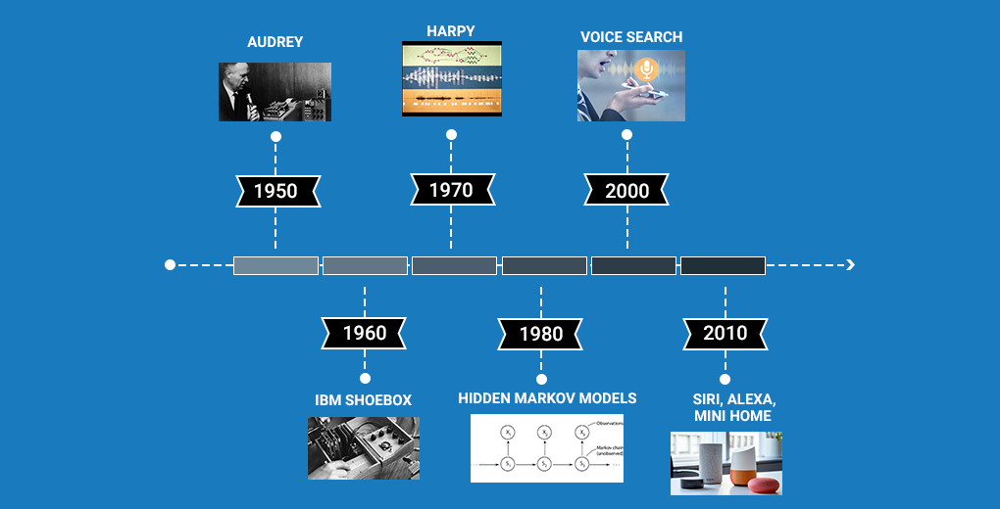

# Speech to Text

## Table of Contents

* A Brief History of Speech Recognition through the Decades 

* Introduction to Signal Processing 

* Different Feature Extraction Techniques from an Audio Signal

* Understanding the Problem Statement for our Speech-to-Text Project

* Implementing the Speech-to-Text Model in Python

## A Brief History of Speech Recognition through the Decades

Exploration of speech recognition goes way back to the 1950s. These systems have been around for over 50 years! We have prepared a neat illustrated timeline for you to quickly understand how Speech Recognition systems have evolved over the decades:

* The first speech recognition system, Audrey, was developed back in 1952 by three Bell Labs researchers. Audrey was designed to recognize only digits

* Just after 10 years, IBM introduced its first speech recognition system IBM Shoebox, which was capable of recognizing 16 words including digits. It could identify commands like  “Five plus three plus eight plus six plus four minus nine, total,” and would print out the correct answer, i.e., 17

* The Defense Advanced Research Projects Agency (DARPA) contributed a lot to speech recognition technology during the 1970s. DARPA funded for around 5 years from 1971-76 to a program called Speech Understanding Research and finally, Harpy was developed which was able to recognize 1011 words. It was quite a big achievement at that time.

* In the 1980s, the Hidden Markov Model (HMM) was applied to the speech recognition system. HMM is a statistical model which is used to model the problems that involve sequential information. It has a pretty good track record in many real-world applications including speech recognition. 

* In 2001, Google introduced the Voice Search application that allowed users to search for queries by speaking to the machine.  This was the first voice-enabled application which was very popular among the people. It made the conversation between the people and machines a lot easier. 

* By 2011, Apple launched Siri that offered a real-time, faster, and easier way to interact with the Apple devices by just using your voice. As of now, Amazon’s Alexa and Google’s Home are the most popular voice command based virtual assistants that are being widely used by consumers across the globe. 

